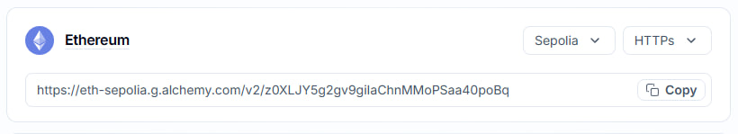
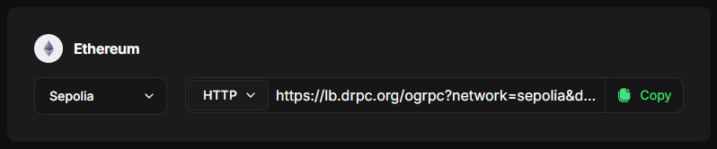
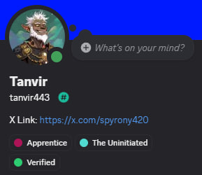

# Aztec-Network-Sequencer-Node-Guide
A step by step guide on How to Run Aztec Network Sequencer Node on Testnet & Earn Apprentice Role.

* **What types of nodes can participate in the testnet?**
  * `Sequencer`: proposes blocks, validates blocks from others, and votes on upgrades.
  * `Prover`: generates ZK proofs that attest to roll-up integrity.

## Hardware Requirements
* **Sequencer Node**: 8 cores CPU, 16GB RAM, 100GB+ SSD
* **Prover Node**: 16 cores and 128GB RAM
* We do NOT run `Prover` sicne it's for data-center computing systems, not for us.

---

**Windows Users**: Must install Ubuntu on Windows (WSL)

**VPS Users**: can get started via a `VPS` with 4 cores CPU, 8GB RAM!

---

## Now Open Ubuntu or WSL (Windows User) and Terminal (Linux and VPS Users) and Copy Paste the Commands Below

## 1. Install Dependecies
* Update packages:
```bash
sudo apt-get update && sudo apt-get upgrade -y
```

* Install Packages:
```bash
sudo apt install curl iptables build-essential git wget lz4 jq make gcc nano automake autoconf tmux htop nvme-cli libgbm1 pkg-config libssl-dev libleveldb-dev tar clang bsdmainutils ncdu unzip libleveldb-dev  -y
```

* Install Docker:
```bash
sudo apt update -y && sudo apt upgrade -y
for pkg in docker.io docker-doc docker-compose podman-docker containerd runc; do sudo apt-get remove $pkg; done

sudo apt-get update
sudo apt-get install ca-certificates curl gnupg
sudo install -m 0755 -d /etc/apt/keyrings
curl -fsSL https://download.docker.com/linux/ubuntu/gpg | sudo gpg --dearmor -o /etc/apt/keyrings/docker.gpg
sudo chmod a+r /etc/apt/keyrings/docker.gpg

echo \
  "deb [arch="$(dpkg --print-architecture)" signed-by=/etc/apt/keyrings/docker.gpg] https://download.docker.com/linux/ubuntu \
  "$(. /etc/os-release && echo "$VERSION_CODENAME")" stable" | \
  sudo tee /etc/apt/sources.list.d/docker.list > /dev/null

sudo apt update -y && sudo apt upgrade -y

sudo apt-get install docker-ce docker-ce-cli containerd.io docker-buildx-plugin docker-compose-plugin

# Test Docker
sudo docker run hello-world

sudo systemctl enable docker
sudo systemctl restart docker
```

## 2. Install Aztec Tools
```bash
bash -i <(curl -s https://install.aztec.network)
```
* **Restart your Terminal** to apply changes.
* Check if you installed successfully:
```bash
aztec --version
```

## 3. Update Aztec
```bash
aztec-up alpha-testnet
```

## 4. Obtain RPC URLs
* Go to [Alchemy](https://dashboard.alchemy.com/), Login or Signup and Create Ethereum App for `RPC URL` & Use [drpc](https://drpc.org/) for `Beacon URL`

* `RPC URL`: Create a Sepolia Ethereum HTTP API in [Alchemy](https://dashboard.alchemy.com/)



* `BEACON RPC`: Create an account on [drpc](https://drpc.org/) and search for `Sepolia Ethereum Beacon Chain ` Endpoints.



## 5. Generate Ethereum Keys
Create New or Another EVM Wallet (Not Main Wallet).

Save `Private Key` and `Wallet Address`.

## 6. Get Sepolia ETH
Send 1/2 `Sepolia ETH` to your new wallet.

## 7. Find IP Address
```bash
curl ipv4.icanhazip.com
```
* Save it

## 8. Enable Firewall & Open Ports
```console
# Firewall
ufw allow 22
ufw allow ssh
ufw enable

# Sequencer
ufw allow 40400
ufw allow 8080
```

## 9. Sequencer Node
* Open screen
```bash
screen -S aztec
```

* Run Node
```
aztec start --node --archiver --sequencer \
  --network alpha-testnet \
  --l1-rpc-urls RPC_URL  \
  --l1-consensus-host-urls BEACON_URL \
  --sequencer.validatorPrivateKey YourPrivateKey \
  --sequencer.coinbase YourAddress \
  --p2p.p2pIp IP
  --p2p.maxTxPoolSize 1000000000
```
Replace the following variables before you Run Node:
* `RPC_URL` & `BEACON_URL` (Step 4)
* `YourPrivateKey`: Your EVM wallet private key (Step 5)
* `YourAddress`: Your EVM wallet address (Step 5)
* `IP`: Your IP Address (Step 7)

## 10. Sync Node
After entering all the command, your node starts running, It takes a few minutes for your node to get synced. Wait 5/10 Minutes.

## 11. Get Role
Go to the discord channel :[operators| start-here](https://discord.com/channels/1144692727120937080/1367196595866828982/1367323893324582954) and follow the prompts, You can continue the guide with my commands if you need help.


**Step 1: Get the latest proven block number:**
```bash
curl -s -X POST -H 'Content-Type: application/json' \
-d '{"jsonrpc":"2.0","method":"node_getL2Tips","params":[],"id":67}' \
http://localhost:8080 | jq -r ".result.proven.number"
```
* Save this block number for the next steps
* Example output: 20905

**Step 2: Generate your sync proof**
```bash
curl -s -X POST -H 'Content-Type: application/json' \
-d '{"jsonrpc":"2.0","method":"node_getArchiveSiblingPath","params":["BLOCK_NUMBER","BLOCK_NUMBER"],"id":67}' \
http://localhost:8080 | jq -r ".result"
```
* Replace `BLOCK_NUMBER` with your number

**Step 3: Register with Discord**
* Type the following command in this Discord server: `/operator start`
* After typing the command, Discord will display option fields that look like this:
* `address`:            Your validator address (Ethereum Address)
* `block-number`:      Block number for verification (Block number from Step 1)
* `proof`:             Your sync proof (base64 string from Step 2)

Then you'll get your `Apprentice` Role



---

* If you want to stop node, click `Ctrl+C`.
* Re-run the node using run command. (Step 9)

* Delete node data:
```bash
rm -r /root/.aztec/alpha-testnet
```
